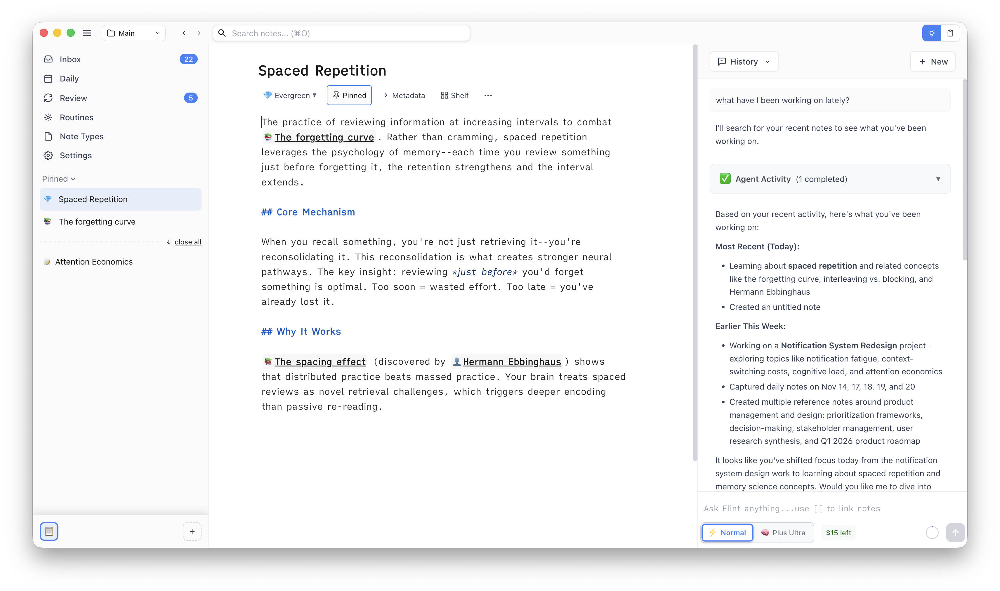

# User Interface Guide

This guide walks you through Flint's interface, explaining each component and how to use it effectively.

## Overview

### Key Areas

1. **Top Bar** - Vault selector, navigation, search
2. **Left Sidebar** - System views, pinned notes, workspaces
3. **Main View** - Note editor where you write
4. **Right Sidebar** - AI agent for assistance and insights

You can **resize** these sections by dragging the dividers between them.

## Top Bar

The top bar provides global actions and navigation.

### Components

**Left side:**

- **Menu** - Application menu
- **Vault Selector** - Switch between vaults (e.g., "Main")
- **Navigation** - Back/forward arrows

**Center:**

- **Search** (`⌘O` / `Ctrl+O`) - Quick search across all notes

**Right side:**

- **Agent/Shelf** - Toggle between AI agent and shelf

### Vault Selector

Click the vault name in the top-left to:

- See all your vaults
- Switch to a different vault
- Create a new vault

## Left Sidebar: Navigation

The left sidebar provides quick access to your notes and system views.

### System Views

At the top of the sidebar, you'll find quick access to:

- **Inbox** - Recently created notes notes (shows count badge)
- **Daily** - Weekly view of daily notes
- **Review** - Access spaced repetition review (shows count badge)
- **Routines** - Manage agent routines and workflows
- **Note Types** - Configure note types
- **Settings** - Application settings

### Pinned Notes and Recent Notes

The left sidebar has two note sections below the system views:

**Pinned Notes:**

Notes you want permanent quick access to. These stay in the sidebar until you unpin them.

- Click the "Pinned" button in the note toolbar to pin a note
- Drag and drop to reorder pinned notes
- Visual indicators show note type (💎 for Evergreen, 📄 for regular notes, etc.)

**Recent Notes:**

Notes you've recently accessed. These appear below pinned notes.

- When you click a wikilink, the note opens in the Recent section
- Click "close all" to clear all recent notes
- Drag and drop to reorder recent notes
- To make a recent note permanent, click the "Pinned" button to move it to the Pinned section

**Best practices:**

- **Pin** notes you reference frequently: active projects, learning notes, reference materials
- **Recent** notes are temporary - let them accumulate as you navigate, then "close all" when done
- **Limit pinned notes to 5-10** - Too many defeats the purpose of quick access

### Workspaces Bar

**At the bottom of the left sidebar**, the workspaces bar lets you organize different contexts within your vault.

**What are workspaces?**

Workspaces are independent contexts that each have their own:

- Pinned notes
- Active view state
- Visual identity (icon)

**Quick actions:**

- **Click workspace icon** - Switch to that workspace
- **Click `+` button** - Create new workspace

**Learn more:** See the [Workspaces feature guide](/features/workspaces) for detailed information.

## Main View: Note Editor

The main view is where you create and edit notes.

### Note Title and Toolbar

At the top of the editor:

- **Note title** - Large, prominent title (e.g., "Spaced Repetition")
- **Note toolbar** - Quick actions for the current note:
  - **Note type** - Note type indicator (click to change)
  - **Pinned** - Pin/unpin this note
  - **Metadata** - Edit YAML frontmatter
  - **Shelf** - Open note in the shelf (for quick reference)
  - **...** - More actions (Preview, Mark for review, Archive)

### Editor Area

**Features:**

- **Markdown syntax highlighting** - Headers, bold, italic, code blocks
- **Auto-save** - Changes saved automatically
- **Wikilink autocomplete** - Type `[[` to search for notes (shown in screenshot as `[[The forgetting curve]]`)
- **Wikilink navigation** - Click links to follow them (e.g., `[[Hermann Ebbinghaus]]`)

## Right Sidebar: AI Agent

The right sidebar features Flint's AI agent for assistance and insights.

### Agent Interface

The agent provides intelligent assistance as you work:

**Conversation view:**

- View selector dropdown (e.g., "History")
- **New** button to start fresh conversations
- Scrollable conversation history
- Your questions and the agent's responses

**What can the agent do?**

The agent can help you:

- Find and summarize recent work
- Answer questions about your notes
- Create connections between ideas
- Organize and structure information
- Track what you've been working on

See [AI Agent](/features/agent) for detailed capabilities.

## Search

The top bar features a prominent search field for quick access to all your notes.

**How to search:**

1. Click the search field or press `⌘O` / `Ctrl+O`
2. Type to search across note titles and content
3. Select a note to open it

**Features:**

- **Instant search** - Results appear as you type
- **Fuzzy matching** - Finds notes even with typos
- **Title and content** - Searches both
- **Keyboard navigation** - Arrow keys to select, Enter to open

See [Search and Discovery](/features/search) for advanced search operators and techniques.

## Settings

Access application settings from the left sidebar's **Settings** option.

**Available settings:**

- **Appearance** - Theme, fonts, layout
- **API Keys** - Configure AI model access
- **Database** - Manage your note database
- **Updates** - Check for new versions

See [Configuration](/guides/configuration) for detailed settings.

## Customization

### Resizing Panels

Drag the dividers between sections to resize:

- Left sidebar width
- Right sidebar width

Your preferred sizes are saved automatically.

### Theme

Choose your theme in Settings:

- **Light** - Always light mode
- **Dark** - Always dark mode
- **System** - Follow OS preference (as shown in screenshot)

### Navigation Workflow

A typical workflow using pinned and recent notes:

1. **Pin your core notes** - Daily note, active projects, key references
2. **Navigate freely** - Click wikilinks to explore, notes appear in Recent
3. **Work across notes** - Recent notes stay accessible as you navigate
4. **Promote important notes** - Click "Pinned" on a recent note to keep it permanently
5. **Clean up** - Click "close all" when you're done exploring to clear recent notes

This keeps your sidebar organized: permanent notes at the top, temporary navigation below.

## Next Steps

Now that you understand the interface:

- **[AI Agent](/features/agent)** - Learn what the AI agent can do
- **[Note Types](/features/notes)** - Understand different note types (Evergreen, Daily, etc.)
- **[Wikilinks](/features/wikilinks)** - Build connected knowledge
- **[Search and Discovery](/features/search)** - Master search techniques

---

**Remember:** Flint's interface is designed to stay out of your way. Focus on capturing and connecting ideas—the tools are there when you need them.
