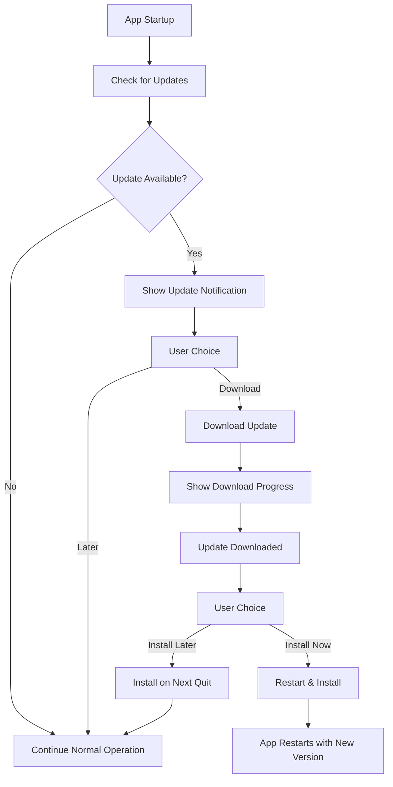

# Flint Auto-Updater System

This document explains how the auto-updater system works and provides instructions for setting up AWS S3 + CloudFront for hosting updates.

## Overview

The Flint application uses `electron-updater` to provide automatic application updates. The system is designed for private/proprietary applications and uses a self-hosted approach with AWS S3 and CloudFront for reliable, global distribution.

## Architecture

### Components

1. **AutoUpdaterService** (`src/main/auto-updater-service.ts`)
   - Manages all update logic in the main process
   - Handles update checking, downloading, and installation
   - Provides IPC communication with the renderer process

2. **Update UI** (`src/renderer/src/components/UpdateNotification.svelte`)
   - User interface for update notifications
   - Progress tracking for downloads
   - Release notes display

3. **IPC Layer** (`src/preload/index.ts`)
   - Secure communication between main and renderer processes
   - Type-safe API for update operations

4. **Configuration** (`electron-builder.yml`)
   - Build configuration for different platforms
   - Update server URL configuration

### Update Flow



## Features

### Automatic Update Checking
- Checks for updates every 4 hours by default
- Manual check via "Check for Updates" button
- Startup check (production only)

### User Control
- Users can choose when to download updates
- Users can choose when to install updates
- Release notes display for informed decisions

### Progress Tracking
- Real-time download progress
- Error handling with user feedback
- Retry functionality for failed operations

### Configuration Options
- Auto-download toggle
- Auto-install on quit toggle
- Prerelease channel support
- Manual update channel configuration

## File Structure

```
src/
├── main/
│   ├── auto-updater-service.ts     # Core auto-updater logic
│   └── index.ts                    # Main process integration
├── preload/
│   └── index.ts                    # IPC API definitions
└── renderer/src/
    ├── components/
    │   ├── UpdateNotification.svelte # Update UI component
    │   └── Settings.svelte          # Settings integration
    └── env.d.ts                     # Type definitions
```

## AWS S3 + CloudFront Setup

### Prerequisites

- AWS Account with appropriate permissions
- AWS CLI installed and configured
- Domain name (optional but recommended)

### Step 1: Create S3 Bucket

1. **Create the bucket:**
   ```bash
   aws s3 mb s3://your-app-updates-bucket --region us-east-1
   ```

2. **Configure bucket policy for public read access:**
   ```json
   {
     "Version": "2012-10-17",
     "Statement": [
       {
         "Sid": "PublicReadGetObject",
         "Effect": "Allow",
         "Principal": "*",
         "Action": "s3:GetObject",
         "Resource": "arn:aws:s3:::your-app-updates-bucket/*"
       }
     ]
   }
   ```

3. **Apply the bucket policy:**
   ```bash
   aws s3api put-bucket-policy --bucket your-app-updates-bucket --policy file://bucket-policy.json
   ```

4. **Enable public access:**
   ```bash
   aws s3api put-public-access-block --bucket your-app-updates-bucket --public-access-block-configuration "BlockPublicAcls=false,IgnorePublicAcls=false,BlockPublicPolicy=false,RestrictPublicBuckets=false"
   ```

### Step 2: Create CloudFront Distribution

1. **Create distribution configuration file** (`cloudfront-distribution.json`):
   ```json
   {
     "CallerReference": "flint-updates-$(date +%s)",
     "Comment": "Flint App Updates Distribution",
     "DefaultCacheBehavior": {
       "TargetOriginId": "S3-your-app-updates-bucket",
       "ViewerProtocolPolicy": "redirect-to-https",
       "MinTTL": 0,
       "DefaultTTL": 86400,
       "MaxTTL": 31536000,
       "ForwardedValues": {
         "QueryString": false,
         "Cookies": {
           "Forward": "none"
         }
       },
       "TrustedSigners": {
         "Enabled": false,
         "Quantity": 0
       }
     },
     "Origins": {
       "Quantity": 1,
       "Items": [
         {
           "Id": "S3-your-app-updates-bucket",
           "DomainName": "your-app-updates-bucket.s3.amazonaws.com",
           "S3OriginConfig": {
             "OriginAccessIdentity": ""
           }
         }
       ]
     },
     "Enabled": true,
     "PriceClass": "PriceClass_100"
   }
   ```

2. **Create the distribution:**
   ```bash
   aws cloudfront create-distribution --distribution-config file://cloudfront-distribution.json
   ```

3. **Note the CloudFront domain name** from the response (e.g., `d1234567890123.cloudfront.net`)

### Step 3: Configure Custom Domain (Optional)

1. **Create SSL certificate in ACM** (must be in us-east-1 for CloudFront):
   ```bash
   aws acm request-certificate --domain-name updates.yourdomain.com --validation-method DNS --region us-east-1
   ```

2. **Validate the certificate** by adding the DNS record provided by ACM

3. **Update CloudFront distribution** to use custom domain:
   ```json
   {
     "Aliases": {
       "Quantity": 1,
       "Items": ["updates.yourdomain.com"]
     },
     "ViewerCertificate": {
       "ACMCertificateArn": "arn:aws:acm:us-east-1:123456789012:certificate/12345678-1234-1234-1234-123456789012",
       "SSLSupportMethod": "sni-only",
       "MinimumProtocolVersion": "TLSv1.2_2021"
     }
   }
   ```

4. **Add CNAME record** in your DNS:
   ```
   Type: CNAME
   Name: updates
   Value: d1234567890123.cloudfront.net
   ```

### Step 4: Update Application Configuration

1. **Update `electron-builder.yml`:**
   ```yaml
   publish:
     provider: generic
     url: https://updates.yourdomain.com  # or https://d1234567890123.cloudfront.net
   ```

2. **For multiple environments, create separate configs:**
   ```yaml
   # electron-builder.yml (production)
   publish:
     provider: generic
     url: https://updates.yourdomain.com

   # dev-app-update.yml (development/staging)
   publish:
     provider: generic
     url: https://staging-updates.yourdomain.com
   ```

### Step 5: Deployment Script

Create a deployment script (`scripts/deploy-updates.sh`):

```bash
#!/bin/bash

# Configuration
BUCKET_NAME="your-app-updates-bucket"
CLOUDFRONT_DISTRIBUTION_ID="E1234567890123"
VERSION=$(node -p "require('./package.json').version")

echo "Deploying version $VERSION..."

# Build the application
npm run build

# Build platform-specific packages
electron-builder --win --publish=never
electron-builder --mac --publish=never
electron-builder --linux --publish=never

# Upload files to S3
aws s3 sync dist/ s3://$BUCKET_NAME/ --delete --exclude "*.blockmap"

# Upload latest files (these contain update metadata)
aws s3 cp dist/latest.yml s3://$BUCKET_NAME/latest.yml
aws s3 cp dist/latest-mac.yml s3://$BUCKET_NAME/latest-mac.yml
aws s3 cp dist/latest-linux.yml s3://$BUCKET_NAME/latest-linux.yml

# Invalidate CloudFront cache for latest files
aws cloudfront create-invalidation --distribution-id $CLOUDFRONT_DISTRIBUTION_ID --paths "/latest*.yml"

echo "Deployment complete!"
echo "Files available at: https://updates.yourdomain.com/"
```

Make it executable:
```bash
chmod +x scripts/deploy-updates.sh
```

### Step 6: GitHub Actions Integration

For automated deployments, create `.github/workflows/release.yml`:

```yaml
name: Build and Deploy Release

on:
  push:
    tags:
      - 'v*'  # Trigger on version tags like v1.0.0

jobs:
  build-and-deploy:
    runs-on: ubuntu-latest

    steps:
    - name: Checkout code
      uses: actions/checkout@v4

    - name: Setup Node.js
      uses: actions/setup-node@v4
      with:
        node-version: '18'
        cache: 'npm'

    - name: Install dependencies
      run: npm ci

    - name: Build application
      run: npm run build

    - name: Build Electron packages
      run: |
        npx electron-builder --win --publish=never
        npx electron-builder --mac --publish=never
        npx electron-builder --linux --publish=never
      env:
        # Add code signing secrets if needed
        CSC_LINK: ${{ secrets.CSC_LINK }}
        CSC_KEY_PASSWORD: ${{ secrets.CSC_KEY_PASSWORD }}

    - name: Configure AWS credentials
      uses: aws-actions/configure-aws-credentials@v4
      with:
        aws-access-key-id: ${{ secrets.AWS_ACCESS_KEY_ID }}
        aws-secret-access-key: ${{ secrets.AWS_SECRET_ACCESS_KEY }}
        aws-region: us-east-1

    - name: Deploy to S3
      env:
        BUCKET_NAME: ${{ secrets.S3_BUCKET_NAME }}
      run: |
        # Upload application files
        aws s3 sync dist/ s3://$BUCKET_NAME/ --delete --exclude "*.blockmap"

        # Upload latest files (update metadata)
        aws s3 cp dist/latest.yml s3://$BUCKET_NAME/latest.yml
        aws s3 cp dist/latest-mac.yml s3://$BUCKET_NAME/latest-mac.yml
        aws s3 cp dist/latest-linux.yml s3://$BUCKET_NAME/latest-linux.yml

    - name: Invalidate CloudFront cache
      env:
        CLOUDFRONT_DISTRIBUTION_ID: ${{ secrets.CLOUDFRONT_DISTRIBUTION_ID }}
      run: |
        aws cloudfront create-invalidation --distribution-id $CLOUDFRONT_DISTRIBUTION_ID --paths "/latest*.yml"

    - name: Create GitHub Release
      uses: softprops/action-gh-release@v1
      with:
        files: |
          dist/*.exe
          dist/*.dmg
          dist/*.AppImage
          dist/*.zip
        generate_release_notes: true
      env:
        GITHUB_TOKEN: ${{ secrets.GITHUB_TOKEN }}
```

#### Required GitHub Secrets

Add these secrets to your repository settings (`Settings > Secrets and variables > Actions`):

- `AWS_ACCESS_KEY_ID` - AWS access key with S3 and CloudFront permissions
- `AWS_SECRET_ACCESS_KEY` - AWS secret access key
- `S3_BUCKET_NAME` - Your S3 bucket name (e.g., `your-app-updates-bucket`)
- `CLOUDFRONT_DISTRIBUTION_ID` - CloudFront distribution ID (e.g., `E1234567890123`)
- `CSC_LINK` - (Optional) Code signing certificate for Windows/macOS
- `CSC_KEY_PASSWORD` - (Optional) Certificate password

#### IAM Policy for GitHub Actions

Create an IAM user with this minimal policy for GitHub Actions:

```json
{
  "Version": "2012-10-17",
  "Statement": [
    {
      "Effect": "Allow",
      "Action": [
        "s3:PutObject",
        "s3:PutObjectAcl",
        "s3:GetObject",
        "s3:DeleteObject",
        "s3:ListBucket"
      ],
      "Resource": [
        "arn:aws:s3:::your-app-updates-bucket",
        "arn:aws:s3:::your-app-updates-bucket/*"
      ]
    },
    {
      "Effect": "Allow",
      "Action": [
        "cloudfront:CreateInvalidation"
      ],
      "Resource": "*"
    }
  ]
}
```

#### Triggering Releases

To deploy a new version:

1. Update version in `package.json`
2. Commit changes: `git commit -am "Release v1.0.1"`
3. Create and push tag: `git tag v1.0.1 && git push origin v1.0.1`
4. GitHub Actions will automatically build and deploy

#### Multi-Environment Setup

For staging/production environments, create separate workflows:

**`.github/workflows/staging.yml`** (triggers on `develop` branch):
```yaml
# Similar to above but with staging bucket/distribution
env:
  BUCKET_NAME: ${{ secrets.STAGING_S3_BUCKET_NAME }}
  CLOUDFRONT_DISTRIBUTION_ID: ${{ secrets.STAGING_CLOUDFRONT_DISTRIBUTION_ID }}
```

**`.github/workflows/production.yml`** (triggers on version tags):
```yaml
# Use production secrets as shown above
```

## Security Considerations

### Code Signing

1. **Windows:** Obtain a code signing certificate and configure in `electron-builder.yml`:
   ```yaml
   win:
     certificateFile: "path/to/certificate.p12"
     certificatePassword: "certificate-password"
   ```

2. **macOS:** Configure with Apple Developer certificate:
   ```yaml
   mac:
     identity: "Developer ID Application: Your Name (TEAM_ID)"
     notarize: true
   ```

### Content Security

1. **Use HTTPS only** for update distribution
2. **Implement checksums** verification (electron-updater does this automatically)
3. **Keep update server logs** for security monitoring
4. **Regular security updates** for dependencies

## Monitoring and Analytics

### CloudWatch Monitoring

Set up CloudWatch alarms for:
- S3 bucket access patterns
- CloudFront cache hit ratios
- Failed update attempts

### Application Metrics

Track update metrics in your application:
```typescript
// Example metrics collection
const updateMetrics = {
  version: currentVersion,
  updateCheckTime: Date.now(),
  downloadTime: downloadDuration,
  installSuccess: true/false,
  errorMessage: errorDetails
};
```

## Troubleshooting

### Common Issues

1. **CORS errors:**
   - Ensure CloudFront is configured correctly
   - Check S3 bucket CORS configuration

2. **Update check failures:**
   - Verify URL accessibility
   - Check network connectivity
   - Validate YAML file format

3. **Download failures:**
   - Check file permissions in S3
   - Verify CloudFront cache behavior
   - Monitor download size limits

### Debug Mode

Enable debug logging in development:
```typescript
// In main process
process.env.ELECTRON_ENABLE_LOGGING = true;
autoUpdater.logger = require("electron-log");
autoUpdater.logger.transports.file.level = "info";
```

### Testing Updates

1. **Local testing:**
   ```bash
   # Set up local update server for testing
   npm install -g http-server
   http-server dist/ -p 3000 --cors
   ```

2. **Staging environment:**
   - Use separate S3 bucket/CloudFront for staging
   - Configure dev-app-update.yml for staging URL

## Cost Estimation

### AWS Costs (approximate monthly)

- **S3 Storage:** $0.02 per GB
- **S3 Requests:** $0.0004 per 1,000 GET requests
- **CloudFront:** $0.085 per GB for first 10 TB
- **Data Transfer:** Varies by region

**Example for 1,000 monthly updates:**
- Storage (500MB app): ~$0.01
- Requests: ~$0.01
- Transfer (500GB): ~$42.50
- **Total: ~$42.52/month**

## Backup and Disaster Recovery

1. **S3 Versioning:** Enable versioning on your S3 bucket
2. **Cross-region replication:** Set up replication to another region
3. **CloudFront failover:** Configure multiple origins for redundancy

## Conclusion

The auto-updater system provides a robust, secure way to distribute updates to your Flint application users. The AWS S3 + CloudFront setup ensures global availability, fast download speeds, and scalable distribution.

For additional security in enterprise environments, consider implementing signed URLs or custom authentication mechanisms.