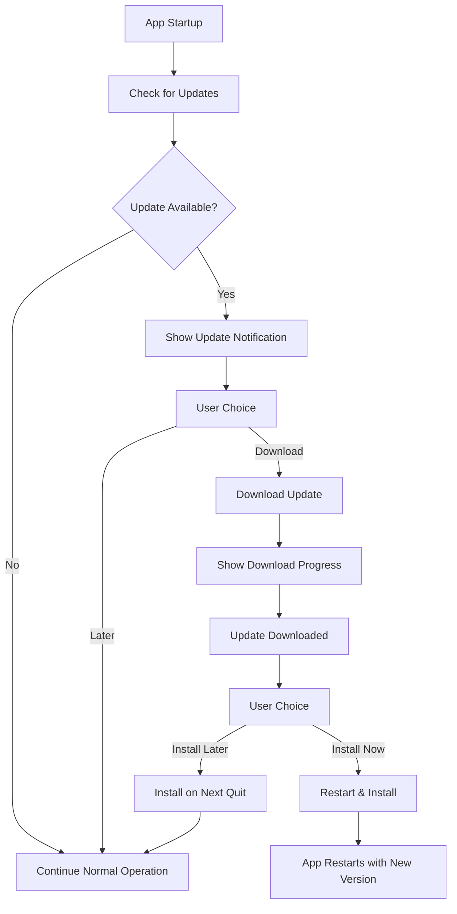

# Flint Auto-Updater System

This document explains how the auto-updater system works and provides instructions for setting up AWS S3 + CloudFront for hosting updates.

## Overview

The Flint application uses `electron-updater` to provide automatic application updates. The system is designed for private/proprietary applications and uses a self-hosted approach with AWS S3 and CloudFront for reliable, global distribution.

## Architecture

### Components

1. **AutoUpdaterService** (`src/main/auto-updater-service.ts`)
   - Manages all update logic in the main process
   - Handles update checking, downloading, and installation
   - Provides IPC communication with the renderer process

2. **Update UI** (`src/renderer/src/components/UpdateNotification.svelte`)
   - User interface for update notifications
   - Progress tracking for downloads
   - Release notes display

3. **IPC Layer** (`src/preload/index.ts`)
   - Secure communication between main and renderer processes
   - Type-safe API for update operations

4. **Configuration** (`electron-builder.yml`)
   - Build configuration for different platforms
   - Update server URL configuration

### Update Flow



## Features

### Automatic Update Checking

- Checks for updates every 4 hours by default
- Manual check via "Check for Updates" button
- Startup check (production only)

### User Control

- Users can choose when to download updates
- Users can choose when to install updates
- Release notes display for informed decisions

### Progress Tracking

- Real-time download progress
- Error handling with user feedback
- Retry functionality for failed operations

### Configuration Options

- Auto-download toggle
- Auto-install on quit toggle
- Prerelease channel support
- Manual update channel configuration

## File Structure

```
src/
├── main/
│   ├── auto-updater-service.ts     # Core auto-updater logic
│   └── index.ts                    # Main process integration
├── preload/
│   └── index.ts                    # IPC API definitions
└── renderer/src/
    ├── components/
    │   ├── UpdateNotification.svelte # Update UI component
    │   └── Settings.svelte          # Settings integration
    └── env.d.ts                     # Type definitions
```

## AWS S3 + CloudFront Setup

### Prerequisites

- AWS Account with appropriate permissions
- AWS CLI installed and configured
- Domain name (optional but recommended)

### Step 1: Create S3 Bucket

1. **Create the bucket:**

   ```bash
   aws s3 mb s3://your-app-updates-bucket --region us-east-1
   ```

2. **Configure bucket policy for public read access:**

   ```json
   {
     "Version": "2012-10-17",
     "Statement": [
       {
         "Sid": "PublicReadGetObject",
         "Effect": "Allow",
         "Principal": "*",
         "Action": "s3:GetObject",
         "Resource": "arn:aws:s3:::your-app-updates-bucket/*"
       }
     ]
   }
   ```

3. **Apply the bucket policy:**

   ```bash
   aws s3api put-bucket-policy --bucket your-app-updates-bucket --policy file://bucket-policy.json
   ```

4. **Enable public access:**
   ```bash
   aws s3api put-public-access-block --bucket your-app-updates-bucket --public-access-block-configuration "BlockPublicAcls=false,IgnorePublicAcls=false,BlockPublicPolicy=false,RestrictPublicBuckets=false"
   ```

### Step 2: Create CloudFront Distribution

1. **Create distribution configuration file** (`cloudfront-distribution.json`):

   ```json
   {
     "CallerReference": "flint-updates-$(date +%s)",
     "Comment": "Flint App Updates Distribution",
     "DefaultCacheBehavior": {
       "TargetOriginId": "S3-your-app-updates-bucket",
       "ViewerProtocolPolicy": "redirect-to-https",
       "MinTTL": 0,
       "DefaultTTL": 86400,
       "MaxTTL": 31536000,
       "ForwardedValues": {
         "QueryString": false,
         "Cookies": {
           "Forward": "none"
         }
       },
       "TrustedSigners": {
         "Enabled": false,
         "Quantity": 0
       }
     },
     "Origins": {
       "Quantity": 1,
       "Items": [
         {
           "Id": "S3-your-app-updates-bucket",
           "DomainName": "your-app-updates-bucket.s3.amazonaws.com",
           "S3OriginConfig": {
             "OriginAccessIdentity": ""
           }
         }
       ]
     },
     "Enabled": true,
     "PriceClass": "PriceClass_100"
   }
   ```

2. **Create the distribution:**

   ```bash
   aws cloudfront create-distribution --distribution-config file://cloudfront-distribution.json
   ```

3. **Note the CloudFront domain name** from the response (e.g., `d1234567890123.cloudfront.net`)

### Step 3: Configure Custom Domain (Optional)

1. **Create SSL certificate in ACM** (must be in us-east-1 for CloudFront):

   ```bash
   aws acm request-certificate --domain-name updates.yourdomain.com --validation-method DNS --region us-east-1
   ```

2. **Validate the certificate** by adding the DNS record provided by ACM

3. **Update CloudFront distribution** to use custom domain:

   ```json
   {
     "Aliases": {
       "Quantity": 1,
       "Items": ["updates.yourdomain.com"]
     },
     "ViewerCertificate": {
       "ACMCertificateArn": "arn:aws:acm:us-east-1:123456789012:certificate/12345678-1234-1234-1234-123456789012",
       "SSLSupportMethod": "sni-only",
       "MinimumProtocolVersion": "TLSv1.2_2021"
     }
   }
   ```

4. **Add CNAME record** in your DNS:
   ```
   Type: CNAME
   Name: updates
   Value: d1234567890123.cloudfront.net
   ```

### Step 4: Update Application Configuration

1. **Update `electron-builder.yml`:**

   ```yaml
   publish:
     provider: generic
     url: https://updates.yourdomain.com # or https://d1234567890123.cloudfront.net
   ```

2. **For multiple environments, create separate configs:**

   ```yaml
   # electron-builder.yml (production)
   publish:
     provider: generic
     url: https://updates.yourdomain.com

   # dev-app-update.yml (development/staging)
   publish:
     provider: generic
     url: https://staging-updates.yourdomain.com
   ```

### Step 5: Deployment Script

Create a deployment script (`scripts/deploy-updates.sh`):

```bash
#!/bin/bash

# Configuration
BUCKET_NAME="your-app-updates-bucket"
CLOUDFRONT_DISTRIBUTION_ID="E1234567890123"
VERSION=$(node -p "require('./package.json').version")

echo "Deploying version $VERSION..."

# Build the application
npm run build

# Build platform-specific packages
electron-builder --win --publish=never
electron-builder --mac --publish=never
electron-builder --linux --publish=never

# Upload files to S3
aws s3 sync dist/ s3://$BUCKET_NAME/ --delete --exclude "*.blockmap"

# Upload latest files (these contain update metadata)
aws s3 cp dist/latest.yml s3://$BUCKET_NAME/latest.yml
aws s3 cp dist/latest-mac.yml s3://$BUCKET_NAME/latest-mac.yml
aws s3 cp dist/latest-linux.yml s3://$BUCKET_NAME/latest-linux.yml

# Invalidate CloudFront cache for latest files
aws cloudfront create-invalidation --distribution-id $CLOUDFRONT_DISTRIBUTION_ID --paths "/latest*.yml"

echo "Deployment complete!"
echo "Files available at: https://updates.yourdomain.com/"
```

Make it executable:

```bash
chmod +x scripts/deploy-updates.sh
```

### Step 6: GitHub Actions Integration

For automated deployments, create `.github/workflows/release.yml`:

```yaml
name: Build and Deploy Release

on:
  push:
    tags:
      - 'v*' # Trigger on version tags like v1.0.0

jobs:
  build-and-deploy:
    runs-on: ubuntu-latest

    steps:
      - name: Checkout code
        uses: actions/checkout@v4

      - name: Setup Node.js
        uses: actions/setup-node@v4
        with:
          node-version: '18'
          cache: 'npm'

      - name: Install dependencies
        run: npm ci

      - name: Build application
        run: npm run build

      - name: Build Electron packages
        run: |
          npx electron-builder --win --publish=never
          npx electron-builder --mac --publish=never
          npx electron-builder --linux --publish=never
        env:
          # Add code signing secrets if needed
          CSC_LINK: ${{ secrets.CSC_LINK }}
          CSC_KEY_PASSWORD: ${{ secrets.CSC_KEY_PASSWORD }}

      - name: Configure AWS credentials
        uses: aws-actions/configure-aws-credentials@v4
        with:
          aws-access-key-id: ${{ secrets.AWS_ACCESS_KEY_ID }}
          aws-secret-access-key: ${{ secrets.AWS_SECRET_ACCESS_KEY }}
          aws-region: us-east-1

      - name: Deploy to S3
        env:
          BUCKET_NAME: ${{ secrets.S3_BUCKET_NAME }}
        run: |
          # Upload application files
          aws s3 sync dist/ s3://$BUCKET_NAME/ --delete --exclude "*.blockmap"

          # Upload latest files (update metadata)
          aws s3 cp dist/latest.yml s3://$BUCKET_NAME/latest.yml
          aws s3 cp dist/latest-mac.yml s3://$BUCKET_NAME/latest-mac.yml
          aws s3 cp dist/latest-linux.yml s3://$BUCKET_NAME/latest-linux.yml

      - name: Invalidate CloudFront cache
        env:
          CLOUDFRONT_DISTRIBUTION_ID: ${{ secrets.CLOUDFRONT_DISTRIBUTION_ID }}
        run: |
          aws cloudfront create-invalidation --distribution-id $CLOUDFRONT_DISTRIBUTION_ID --paths "/latest*.yml"

      - name: Create GitHub Release
        uses: softprops/action-gh-release@v1
        with:
          files: |
            dist/*.exe
            dist/*.dmg
            dist/*.AppImage
            dist/*.zip
          generate_release_notes: true
        env:
          GITHUB_TOKEN: ${{ secrets.GITHUB_TOKEN }}
```

#### Required GitHub Secrets

Add these secrets to your repository settings (`Settings > Secrets and variables > Actions`):

- `AWS_ACCESS_KEY_ID` - AWS access key with S3 and CloudFront permissions
- `AWS_SECRET_ACCESS_KEY` - AWS secret access key
- `S3_BUCKET_NAME` - Your S3 bucket name (e.g., `your-app-updates-bucket`)
- `CLOUDFRONT_DISTRIBUTION_ID` - CloudFront distribution ID (e.g., `E1234567890123`)
- `CSC_LINK` - (Optional) Code signing certificate for Windows/macOS
- `CSC_KEY_PASSWORD` - (Optional) Certificate password

#### IAM Policy for GitHub Actions

Create an IAM user with this minimal policy for GitHub Actions:

```json
{
  "Version": "2012-10-17",
  "Statement": [
    {
      "Effect": "Allow",
      "Action": [
        "s3:PutObject",
        "s3:PutObjectAcl",
        "s3:GetObject",
        "s3:DeleteObject",
        "s3:ListBucket"
      ],
      "Resource": [
        "arn:aws:s3:::your-app-updates-bucket",
        "arn:aws:s3:::your-app-updates-bucket/*"
      ]
    },
    {
      "Effect": "Allow",
      "Action": ["cloudfront:CreateInvalidation"],
      "Resource": "*"
    }
  ]
}
```

#### Triggering Releases

To deploy a new version:

1. Update version in `package.json`
2. Commit changes: `git commit -am "Release v1.0.1"`
3. Create and push tag: `git tag v1.0.1 && git push origin v1.0.1`
4. GitHub Actions will automatically build and deploy

#### Multi-Environment Setup

For staging/production environments, create separate workflows:

**`.github/workflows/staging.yml`** (triggers on `develop` branch):

```yaml
# Similar to above but with staging bucket/distribution
env:
  BUCKET_NAME: ${{ secrets.STAGING_S3_BUCKET_NAME }}
  CLOUDFRONT_DISTRIBUTION_ID: ${{ secrets.STAGING_CLOUDFRONT_DISTRIBUTION_ID }}
```

**`.github/workflows/production.yml`** (triggers on version tags):

```yaml
# Use production secrets as shown above
```

## Security Considerations

### Code Signing

1. **Windows:** Obtain a code signing certificate and configure in `electron-builder.yml`:

   ```yaml
   win:
     certificateFile: 'path/to/certificate.p12'
     certificatePassword: 'certificate-password'
   ```

2. **macOS:** Configure with Apple Developer certificate:
   ```yaml
   mac:
     identity: 'Developer ID Application: Your Name (TEAM_ID)'
     notarize: true
   ```

## macOS Code Signing Setup

### Prerequisites

1. **Apple Developer Account** - Enrolled in Apple Developer Program ($99/year)
2. **Xcode** - Installed on macOS for certificate management
3. **Developer ID Application Certificate** - For distribution outside App Store

### Step 1: Create Certificates

1. **Log into Apple Developer Portal:**
   - Go to [developer.apple.com](https://developer.apple.com)
   - Navigate to Certificates, Identifiers & Profiles

2. **Create Developer ID Application Certificate:**
   - Click "+" to create new certificate
   - Select "Developer ID Application" (for apps distributed outside Mac App Store)
   - Follow prompts to upload Certificate Signing Request (CSR)
   - Download the certificate (.cer file)

3. **Install Certificate:**
   - Double-click the .cer file to install in Keychain Access
   - Verify it appears under "My Certificates" in Keychain Access

### Step 2: Configure Environment Variables

For local development, add to your shell profile (`.zshrc`, `.bash_profile`):

```bash
# macOS code signing
export CSC_NAME="Developer ID Application: Your Name (TEAM_ID)"
export APPLE_ID="your-apple-id@example.com"
export APPLE_ID_PASSWORD="app-specific-password"  # See below
export APPLE_TEAM_ID="YOUR_TEAM_ID"
```

### Step 3: App-Specific Password for Notarization

1. **Generate App-Specific Password:**
   - Go to [appleid.apple.com](https://appleid.apple.com)
   - Sign in with your Apple ID
   - In Security section, generate app-specific password
   - Label it "Electron App Notarization"
   - Save the generated password securely

2. **Store in Keychain (Recommended):**
   ```bash
   xcrun notarytool store-credentials "flint-notarization" \
     --apple-id "your-apple-id@example.com" \
     --team-id "YOUR_TEAM_ID" \
     --password "app-specific-password"
   ```

### Step 4: Update electron-builder Configuration

```yaml
# electron-builder.yml
mac:
  category: public.app-category.productivity
  icon: 'build/icon.icns'
  identity: 'Developer ID Application: Your Name (TEAM_ID)'
  hardenedRuntime: true
  gatekeeperAssess: false
  entitlements: 'build/entitlements.mac.plist'
  entitlementsInherit: 'build/entitlements.mac.plist'
  notarize: { teamId: 'YOUR_TEAM_ID' }
```

### Step 5: Create Entitlements File

Create `build/entitlements.mac.plist`:

```xml
<?xml version="1.0" encoding="UTF-8"?>
<!DOCTYPE plist PUBLIC "-//Apple//DTD PLIST 1.0//EN" "http://www.apple.com/DTDs/PropertyList-1.0.dtd">
<plist version="1.0">
<dict>
  <key>com.apple.security.cs.allow-jit</key>
  <true/>
  <key>com.apple.security.cs.allow-unsigned-executable-memory</key>
  <true/>
  <key>com.apple.security.cs.disable-executable-page-protection</key>
  <true/>
  <key>com.apple.security.cs.disable-library-validation</key>
  <true/>
  <key>com.apple.security.network.client</key>
  <true/>
  <key>com.apple.security.network.server</key>
  <true/>
  <key>com.apple.security.files.user-selected.read-write</key>
  <true/>
</dict>
</plist>
```

### Step 6: GitHub Actions Configuration

Update your GitHub Actions workflow with macOS signing secrets:

```yaml
# .github/workflows/release.yml
jobs:
  build-and-deploy:
    runs-on: macos-latest # Required for macOS signing

    steps:
      # ... other steps ...

      - name: Import Code Signing Certificate
        if: runner.os == 'macOS'
        uses: apple-actions/import-codesign-certs@v2
        with:
          p12-file-base64: ${{ secrets.CSC_LINK }}
          p12-password: ${{ secrets.CSC_KEY_PASSWORD }}

      - name: Build Electron packages
        run: |
          npx electron-builder --mac --publish=never
        env:
          CSC_NAME: ${{ secrets.CSC_NAME }}
          APPLE_ID: ${{ secrets.APPLE_ID }}
          APPLE_ID_PASSWORD: ${{ secrets.APPLE_ID_PASSWORD }}
          APPLE_TEAM_ID: ${{ secrets.APPLE_TEAM_ID }}
```

### Step 7: GitHub Secrets for macOS Signing

Add these additional secrets to your repository:

- `CSC_LINK` - Base64 encoded .p12 certificate file
- `CSC_KEY_PASSWORD` - Password for the .p12 certificate
- `CSC_NAME` - Certificate name (e.g., "Developer ID Application: Your Name (TEAM_ID)")
- `APPLE_ID` - Your Apple ID email
- `APPLE_ID_PASSWORD` - App-specific password for notarization
- `APPLE_TEAM_ID` - Your Apple Developer Team ID

### Step 8: Export Certificate for CI/CD

1. **Export from Keychain:**
   - Open Keychain Access
   - Find your "Developer ID Application" certificate
   - Right-click → Export
   - Choose Personal Information Exchange (.p12)
   - Set a strong password

2. **Convert to Base64:**

   ```bash
   base64 -i certificate.p12 | pbcopy
   ```

   - Paste the result into `CSC_LINK` GitHub secret

### Step 9: Testing Signing Locally

```bash
# Build and sign locally
npm run build
npx electron-builder --mac --publish=never

# Verify signature
codesign --verify --deep --strict dist/mac/Flint.app
spctl --assess --verbose dist/mac/Flint.app

# Check notarization status (after upload)
xcrun notarytool history --keychain-profile "flint-notarization"
```

## Local Notarization Testing

This section covers how to manually notarize your macOS application locally for testing purposes before deploying through CI/CD.

### Prerequisites for Local Notarization

1. **Completed Code Signing Setup** - Follow all previous macOS code signing steps
2. **Built Application** - Have a signed .app or .dmg file ready
3. **Keychain Profile** - Notarytool credentials stored (from Step 3 above)

### Step 1: Build and Sign Application

```bash
# Build the application
npm run build
npx electron-builder --mac --publish=never

# Verify the build was signed
codesign --verify --deep --strict dist/mac/Flint.app
```

### Step 2: Submit for Notarization

**Option A: Submit .app bundle directly:**

```bash
# Submit the app bundle
xcrun notarytool submit dist/mac/Flint.app \
  --keychain-profile "flint-notarization" \
  --wait

# Note: --wait flag makes the command wait for completion
```

**Option B: Submit .dmg file (recommended):**

```bash
# If you have a .dmg file
xcrun notarytool submit dist/Flint-1.0.0.dmg \
  --keychain-profile "flint-notarization" \
  --wait
```

### Step 3: Monitor Submission Status

**Check submission without waiting:**

```bash
# Submit without waiting
SUBMISSION_ID=$(xcrun notarytool submit dist/mac/Flint.app \
  --keychain-profile "flint-notarization" | \
  grep "id:" | awk '{print $2}')

# Check status manually
xcrun notarytool info $SUBMISSION_ID \
  --keychain-profile "flint-notarization"
```

**View all recent submissions:**

```bash
# List recent notarization history
xcrun notarytool history \
  --keychain-profile "flint-notarization"
```

### Step 4: Handle Notarization Results

**If notarization succeeds:**

```bash
# For .app bundles, staple the notarization ticket
xcrun stapler staple dist/mac/Flint.app

# Verify stapling worked
xcrun stapler validate dist/mac/Flint.app

# Test Gatekeeper assessment
spctl --assess --verbose=2 dist/mac/Flint.app
```

**If notarization fails:**

```bash
# Get detailed logs for failed submission
xcrun notarytool log $SUBMISSION_ID \
  --keychain-profile "flint-notarization"

# Save logs to file for analysis
xcrun notarytool log $SUBMISSION_ID \
  --keychain-profile "flint-notarization" \
  > notarization-log.json
```

### Step 5: Local Testing Script

Create a script for local notarization testing (`scripts/test-notarization.sh`):

```bash
#!/bin/bash

set -e

# Configuration
APP_NAME="Flint"
VERSION=$(node -p "require('./package.json').version")
KEYCHAIN_PROFILE="flint-notarization"

echo "Starting local notarization test for $APP_NAME v$VERSION..."

# Build the application
echo "Building application..."
npm run build
npx electron-builder --mac --publish=never

# Verify signing
echo "Verifying code signature..."
codesign --verify --deep --strict "dist/mac/$APP_NAME.app"

# Submit for notarization
echo "Submitting for notarization..."
SUBMISSION_ID=$(xcrun notarytool submit "dist/mac/$APP_NAME.app" \
  --keychain-profile "$KEYCHAIN_PROFILE" \
  --output-format json | jq -r '.id')

echo "Submission ID: $SUBMISSION_ID"
echo "Waiting for notarization to complete..."

# Wait for completion (timeout after 10 minutes)
TIMEOUT=600
ELAPSED=0
INTERVAL=30

while [ $ELAPSED -lt $TIMEOUT ]; do
  STATUS=$(xcrun notarytool info "$SUBMISSION_ID" \
    --keychain-profile "$KEYCHAIN_PROFILE" \
    --output-format json | jq -r '.status')

  echo "Status: $STATUS (${ELAPSED}s elapsed)"

  if [ "$STATUS" = "Accepted" ]; then
    echo "✅ Notarization successful!"

    # Staple the ticket
    echo "Stapling notarization ticket..."
    xcrun stapler staple "dist/mac/$APP_NAME.app"

    # Verify stapling
    echo "Verifying staple..."
    xcrun stapler validate "dist/mac/$APP_NAME.app"

    # Test Gatekeeper
    echo "Testing Gatekeeper assessment..."
    spctl --assess --verbose=2 "dist/mac/$APP_NAME.app"

    echo "✅ Local notarization test completed successfully!"
    exit 0
  elif [ "$STATUS" = "Invalid" ]; then
    echo "❌ Notarization failed!"
    echo "Fetching logs..."
    xcrun notarytool log "$SUBMISSION_ID" \
      --keychain-profile "$KEYCHAIN_PROFILE" \
      > "notarization-log-$SUBMISSION_ID.json"
    echo "Logs saved to: notarization-log-$SUBMISSION_ID.json"
    exit 1
  fi

  sleep $INTERVAL
  ELAPSED=$((ELAPSED + INTERVAL))
done

echo "❌ Notarization timed out after ${TIMEOUT} seconds"
exit 1
```

Make it executable:

```bash
chmod +x scripts/test-notarization.sh
```

### Step 6: Common Local Testing Scenarios

**Test with different build configurations:**

```bash
# Test development build
npm run build:dev
npx electron-builder --mac --config=dev-app-update.yml --publish=never
xcrun notarytool submit dist/mac/Flint.app --keychain-profile "flint-notarization"

# Test production build
npm run build
npx electron-builder --mac --publish=never
xcrun notarytool submit dist/mac/Flint.app --keychain-profile "flint-notarization"
```

**Batch testing multiple artifacts:**

```bash
# Build all platforms and test macOS notarization
npx electron-builder --mac --win --linux --publish=never

# Submit multiple macOS artifacts if available
find dist -name "*.dmg" -exec xcrun notarytool submit {} \
  --keychain-profile "flint-notarization" \;
```

### Step 7: Troubleshooting Local Notarization

**Common Issues and Solutions:**

1. **Bundle format rejected:**
   ```bash
   # Check bundle structure
   find dist/mac/Flint.app -name "*.dylib" -o -name "*.so"

   # Verify all binaries are signed
   find dist/mac/Flint.app -type f -perm +111 -exec codesign --verify {} \;
   ```

2. **Hardened runtime violations:**
   ```bash
   # Check entitlements
   codesign -d --entitlements - dist/mac/Flint.app

   # Verify entitlements file is properly configured
   plutil -lint build/entitlements.mac.plist
   ```

3. **Credential issues:**
   ```bash
   # Verify keychain profile
   xcrun notarytool history --keychain-profile "flint-notarization"

   # Test with environment variables instead
   export APPLE_ID="your-apple-id@example.com"
   export APPLE_ID_PASSWORD="app-specific-password"
   export APPLE_TEAM_ID="YOUR_TEAM_ID"

   xcrun notarytool submit dist/mac/Flint.app \
     --apple-id "$APPLE_ID" \
     --password "$APPLE_ID_PASSWORD" \
     --team-id "$APPLE_TEAM_ID"
   ```

### Best Practices for Local Testing

1. **Test Early and Often** - Don't wait until release to test notarization
2. **Keep Logs** - Save notarization logs for debugging patterns
3. **Verify Stapling** - Always test stapling after successful notarization
4. **Test Different Environments** - Test both development and production builds
5. **Monitor Timing** - Track how long notarization takes for your app size

### Integration with Development Workflow

Add notarization testing to your development process:

```bash
# Add to package.json scripts
{
  "scripts": {
    "test:notarize": "./scripts/test-notarization.sh",
    "build:test": "npm run build && npm run test:notarize"
  }
}
```

This allows developers to test notarization locally with:

```bash
npm run test:notarize
```

### Troubleshooting macOS Signing

1. **Certificate Issues:**

   ```bash
   # List available certificates
   security find-identity -v -p codesigning

   # Verify certificate chain
   security verify-cert -c certificate.cer
   ```

2. **Notarization Failures:**

   ```bash
   # Check notarization logs
   xcrun notarytool log <submission-id> --keychain-profile "flint-notarization"
   ```

3. **Common Issues:**
   - **"No identity found"** - Certificate not installed or expired
   - **"Hardened runtime violations"** - Missing entitlements
   - **"Notarization failed"** - Check logs for specific violations

### Cost Considerations

- **Apple Developer Program:** $99/year (required)
- **Code signing is included** in the developer program
- **Notarization is free** but requires valid developer account

### Content Security

1. **Use HTTPS only** for update distribution
2. **Implement checksums** verification (electron-updater does this automatically)
3. **Keep update server logs** for security monitoring
4. **Regular security updates** for dependencies

## Monitoring and Analytics

### CloudWatch Monitoring

Set up CloudWatch alarms for:

- S3 bucket access patterns
- CloudFront cache hit ratios
- Failed update attempts

### Application Metrics

Track update metrics in your application:

```typescript
// Example metrics collection
const updateMetrics = {
  version: currentVersion,
  updateCheckTime: Date.now(),
  downloadTime: downloadDuration,
  installSuccess: true / false,
  errorMessage: errorDetails
};
```

## Troubleshooting

### Common Issues

1. **CORS errors:**
   - Ensure CloudFront is configured correctly
   - Check S3 bucket CORS configuration

2. **Update check failures:**
   - Verify URL accessibility
   - Check network connectivity
   - Validate YAML file format

3. **Download failures:**
   - Check file permissions in S3
   - Verify CloudFront cache behavior
   - Monitor download size limits

### Debug Mode

Enable debug logging in development:

```typescript
// In main process
process.env.ELECTRON_ENABLE_LOGGING = true;
autoUpdater.logger = require('electron-log');
autoUpdater.logger.transports.file.level = 'info';
```

### Testing Updates

1. **Local testing:**

   ```bash
   # Set up local update server for testing
   npm install -g http-server
   http-server dist/ -p 3000 --cors
   ```

2. **Staging environment:**
   - Use separate S3 bucket/CloudFront for staging
   - Configure dev-app-update.yml for staging URL

## Cost Estimation

### AWS Costs (approximate monthly)

- **S3 Storage:** $0.02 per GB
- **S3 Requests:** $0.0004 per 1,000 GET requests
- **CloudFront:** $0.085 per GB for first 10 TB
- **Data Transfer:** Varies by region

**Example for 1,000 monthly updates:**

- Storage (500MB app): ~$0.01
- Requests: ~$0.01
- Transfer (500GB): ~$42.50
- **Total: ~$42.52/month**

## Backup and Disaster Recovery

1. **S3 Versioning:** Enable versioning on your S3 bucket
2. **Cross-region replication:** Set up replication to another region
3. **CloudFront failover:** Configure multiple origins for redundancy

## Conclusion

The auto-updater system provides a robust, secure way to distribute updates to your Flint application users. The AWS S3 + CloudFront setup ensures global availability, fast download speeds, and scalable distribution.

For additional security in enterprise environments, consider implementing signed URLs or custom authentication mechanisms.
