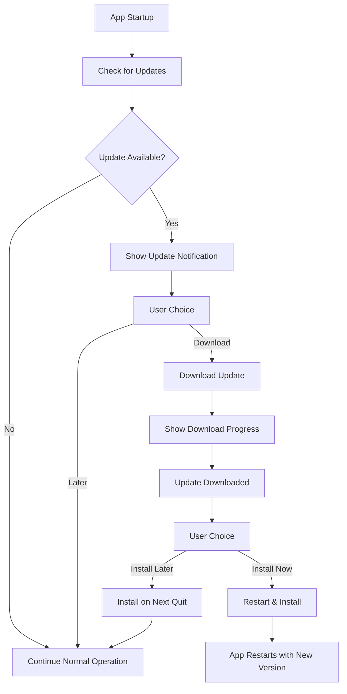

# Flint Auto-Updater System

This document explains how the auto-updater system works and provides instructions for setting up Cloudflare R2 for hosting updates.

## Overview

The Flint application uses `electron-updater` to provide automatic application updates. The system is designed for private/proprietary applications and uses Cloudflare R2 for cost-effective, reliable distribution with zero egress fees.

**Current Version:** The application is currently at version 0.1.1 (as specified in `package.json`). Auto-updates will only trigger when a higher version number is available on the update server.

## Update Trains (Production and Canary)

Flint uses a **dual-train update system** to safely test new features before releasing them to all users:

### Production Train

- **URL:** `https://updates.flintnote.com`
- **Version Format:** Stable semver (e.g., `1.0.0`, `1.0.1`, `1.1.0`)
- **Purpose:** Stable releases for all users
- **Configuration:** `electron-builder.production.yml`
- **Build Commands:**
  - `npm run build:mac:production`
  - `npm run build:win:production`
  - `npm run build:linux:production`

### Canary Train

- **URL:** `https://canary.flintnote.com`
- **Version Format:** Prerelease semver (e.g., `1.1.0-canary.1`, `1.2.0-canary.2`)
- **Purpose:** Early testing of new features and bug fixes
- **Configuration:** `electron-builder.canary.yml`
- **Product Name:** "Flint Canary" (distinguishable from production)
- **Build Commands:**
  - `npm run build:mac:canary`
  - `npm run build:win:canary`
  - `npm run build:linux:canary`

### Key Differences

| Aspect       | Production                               | Canary                      |
| ------------ | ---------------------------------------- | --------------------------- |
| Update URL   | `updates.flintnote.com`                  | `canary.flintnote.com`      |
| Version      | Stable (1.0.0)                           | Prerelease (1.0.0-canary.1) |
| R2 Bucket    | `flint-updates-production`               | `flint-updates-canary`      |
| App Name     | "Flint"                                  | "Flint Canary"              |
| Executable   | `flint`                                  | `flint-canary`              |
| Installation | Separate - users can have both installed |

### Versioning Strategy

**Production releases:**

```bash
# Increment version for production release
npm version 1.0.1
npm run build:mac:production
# Tag and push
git tag v1.0.1
git push origin v1.0.1
```

**Canary releases:**

```bash
# Use prerelease tag for canary
npm version 1.1.0-canary.1
npm run build:mac:canary
# Tag and push
git tag v1.1.0-canary.1
git push origin v1.1.0-canary.1
```

**Promoting Canary to Production:**
When a canary version is stable, remove the prerelease tag:

```bash
# Canary 1.1.0-canary.3 is stable, promote to production
npm version 1.1.0
npm run build:mac:production
git tag v1.1.0
git push origin v1.1.0
```

## Architecture

### Components

1. **AutoUpdaterService** (`src/main/auto-updater-service.ts`)
   - Manages all update logic in the main process
   - Handles update checking, downloading, and installation
   - Provides IPC communication with the renderer process

2. **Update UI** (`src/renderer/src/components/UpdateNotification.svelte`)
   - User interface for update notifications
   - Progress tracking for downloads
   - Release notes display

3. **IPC Layer** (`src/preload/index.ts`)
   - Secure communication between main and renderer processes
   - Type-safe API for update operations

4. **Configuration** (`electron-builder.yml`)
   - Build configuration for different platforms
   - Update server URL configuration

### Update Flow



## Features

### Automatic Update Checking

- Can be configured with custom intervals (default not set - must be enabled manually)
- Manual check via "Check for Updates" button
- Optional startup check with configurable delay (10 seconds by default)

### User Control

- Users can choose when to download updates
- Users can choose when to install updates
- Release notes display for informed decisions

### Progress Tracking

- Real-time download progress
- Error handling with user feedback
- Retry functionality for failed operations

### Configuration Options

- Auto-download toggle (default: false - users must manually trigger downloads)
- Auto-install on quit toggle (default: true)
- Allow prerelease updates
- Allow downgrade to older versions

## File Structure

```
src/
├── main/
│   ├── auto-updater-service.ts     # Core auto-updater logic
│   └── index.ts                    # Main process integration
├── preload/
│   └── index.ts                    # IPC API definitions
└── renderer/src/
    ├── components/
    │   ├── UpdateNotification.svelte # Update UI component
    │   └── Settings.svelte          # Settings integration
    └── env.d.ts                     # Type definitions
```

## Cloudflare R2 Setup

### Prerequisites

- Cloudflare account (free tier available)
- Wrangler CLI installed (optional, for local testing): `npm install -g wrangler`

### Why Cloudflare R2?

- **Zero egress fees** - No bandwidth charges for downloads
- **S3-compatible API** - Works with existing tools
- **Global CDN** - Fast downloads worldwide via Cloudflare's network
- **Cost-effective** - Pay only for storage (~$0.015/GB/month) and minimal operation fees

### Step 1: Create R2 Buckets

You need to create **two separate R2 buckets** for the dual-train system:

1. **Log into Cloudflare Dashboard:**
   - Go to [dash.cloudflare.com](https://dash.cloudflare.com)
   - Navigate to R2 Object Storage

2. **Create production bucket:**
   - Click "Create bucket"
   - Name it `flint-updates-production`
   - Choose a location (Automatic is recommended)

3. **Create canary bucket:**
   - Click "Create bucket"
   - Name it `flint-updates-canary`
   - Choose a location (Automatic is recommended)

4. **Enable public access for both buckets:**
   - For each bucket, go to Settings → Public Access
   - Click "Connect Domain" or "Allow Access"
   - Connect custom domains:
     - Production: `updates.flintnote.com` → `flint-updates-production`
     - Canary: `canary.flintnote.com` → `flint-updates-canary`
   - Alternatively, note the public R2.dev URLs if not using custom domains

### Step 2: Create API Token

1. **Generate R2 API Token:**
   - In Cloudflare Dashboard → R2 → Manage R2 API Tokens
   - Click "Create API token"
   - Permissions: Object Read & Write
   - Scope to your specific bucket (optional but recommended)
   - Save the Access Key ID and Secret Access Key

### Step 3: Update Application Configuration

The application is already configured with separate config files for each train:

1. **Production configuration (`electron-builder.production.yml`):**

   ```yaml
   publish:
     provider: generic
     url: https://updates.flintnote.com
   ```

2. **Canary configuration (`electron-builder.canary.yml`):**

   ```yaml
   publish:
     provider: generic
     url: https://canary.flintnote.com
   ```

3. **Build scripts are already set up in `package.json`:**
   - Production: `npm run build:mac:production`, `build:win:production`, `build:linux:production`
   - Canary: `npm run build:mac:canary`, `build:win:canary`, `build:linux:canary`

### Step 4: Manual Deployment (Optional)

For quick testing, you can manually upload using Wrangler CLI or AWS CLI (R2 is S3-compatible):

**Using Wrangler:**

```bash
# Install wrangler
npm install -g wrangler

# Authenticate
wrangler login

# Build production release
npm run build:mac:production  # or build:win:production, build:linux:production

# Upload to production R2 bucket
wrangler r2 object put flint-updates-production/latest.yml --file=dist/latest.yml
wrangler r2 object put flint-updates-production/latest-mac.yml --file=dist/latest-mac.yml
# ... upload other files

# Build canary release
npm version 1.1.0-canary.1
npm run build:mac:canary  # or build:win:canary, build:linux:canary

# Upload to canary R2 bucket
wrangler r2 object put flint-updates-canary/latest.yml --file=dist/latest.yml
wrangler r2 object put flint-updates-canary/latest-mac.yml --file=dist/latest-mac.yml
# ... upload other files
```

**Using AWS CLI (S3-compatible):**

```bash
# Configure AWS CLI with R2 credentials
aws configure --profile r2
# Enter your R2 Access Key ID and Secret Access Key
# Region: auto
# Endpoint: https://<account-id>.r2.cloudflarestorage.com

# Upload production build
npm run build:mac:production
aws s3 sync dist/ s3://flint-updates-production/ --profile r2 --endpoint-url https://<account-id>.r2.cloudflarestorage.com

# Upload canary build
npm version 1.1.0-canary.1
npm run build:mac:canary
aws s3 sync dist/ s3://flint-updates-canary/ --profile r2 --endpoint-url https://<account-id>.r2.cloudflarestorage.com
```

### Step 5: GitHub Actions Integration

The project includes two GitHub Actions workflows:

1. **`.github/workflows/build.yml`** - Runs on push to main/develop and PRs. Builds and tests all platforms.
2. **`.github/workflows/release.yml`** - Runs on version tags (v\*). Automatically determines production vs canary based on tag name and deploys to the appropriate R2 bucket.

#### Current Release Workflow

The release workflow (`.github/workflows/release.yml`) is already configured with:

- **Automatic train detection**: Detects production vs canary based on tag name (e.g., `v1.0.0` vs `v1.0.0-canary.1`)
- **Dynamic bucket selection**: Automatically deploys to the correct R2 bucket
- **Platform-specific builds**: Uses correct build command (`build:mac:production` or `build:mac:canary`)
- **Code signing and notarization**: Automatic code signing for macOS and Windows
- **R2 deployment**: Direct upload to the appropriate R2 bucket
- **GitHub release creation**: Creates release with correct prerelease flag

#### How It Works

The workflow determines the release train based on the git tag:

1. **Production releases** (tags like `v1.0.0`, `v1.0.1`):
   - Uses `electron-builder.production.yml` configuration
   - Deploys to `R2_PRODUCTION_BUCKET_NAME` bucket
   - Update URL: `https://updates.flintnote.com`
   - Creates stable GitHub release

2. **Canary releases** (tags like `v1.0.0-canary.1`, `v1.1.0-canary.2`):
   - Uses `electron-builder.canary.yml` configuration
   - Deploys to `R2_CANARY_BUCKET_NAME` bucket
   - Update URL: `https://canary.flintnote.com`
   - Creates prerelease GitHub release

#### Required GitHub Secrets

Add these secrets to your repository settings (`Settings > Secrets and variables > Actions`):

**For R2 deployment (dual-train system):**

- `R2_ACCESS_KEY_ID` - R2 API token Access Key ID
- `R2_SECRET_ACCESS_KEY` - R2 API token Secret Access Key
- `R2_PRODUCTION_BUCKET_NAME` - Production R2 bucket name (e.g., `flint-updates-production`)
- `R2_CANARY_BUCKET_NAME` - Canary R2 bucket name (e.g., `flint-updates-canary`)
- `CLOUDFLARE_ACCOUNT_ID` - Your Cloudflare account ID (found in R2 dashboard)

**For Windows code signing:**

- `CSC_LINK` - Base64-encoded .p12 certificate file for Windows
- `CSC_KEY_PASSWORD` - Certificate password for Windows

**For macOS code signing and notarization:**

- `CSC_LINK` - Base64-encoded .p12 certificate file for macOS (same variable name, different certificate)
- `CSC_KEY_PASSWORD` - Certificate password for macOS
- `APPLE_ID` - Your Apple ID email
- `APPLE_ID_PASSWORD` - App-specific password for notarization
- `APPLE_TEAM_ID` - Your Apple Developer Team ID

**Note:** If you're building for both platforms, `CSC_LINK` and `CSC_KEY_PASSWORD` can be reused if you use the same certificate format, or you can set them conditionally per platform in the workflow.

#### Getting R2 Credentials

1. **Access Key and Secret:**
   - Go to Cloudflare Dashboard → R2 → Manage R2 API Tokens
   - Click "Create API token"
   - Give it a name (e.g., "GitHub Actions - Flint Updates")
   - Permissions: Object Read & Write
   - Optionally scope to specific bucket
   - Copy both the Access Key ID and Secret Access Key
   - Add as `R2_ACCESS_KEY_ID` and `R2_SECRET_ACCESS_KEY` in GitHub secrets

2. **Account ID:**
   - Found in Cloudflare Dashboard → R2 (in the URL or sidebar)
   - Format: 32-character hex string
   - Add as `CLOUDFLARE_ACCOUNT_ID` in GitHub secrets

3. **Bucket Name:**
   - The name you gave your bucket (e.g., `flint-updates`)
   - Add as `R2_BUCKET_NAME` in GitHub secrets

#### Triggering Releases

**Production release:**

```bash
# Update version to stable semver
npm version 1.0.1
git push origin main
git push origin v1.0.1
# GitHub Actions automatically builds and deploys to production bucket
```

**Canary release:**

```bash
# Update version with canary prerelease tag
npm version 1.1.0-canary.1
git push origin main
git push origin v1.1.0-canary.1
# GitHub Actions automatically builds and deploys to canary bucket
```

The workflow automatically:

1. Detects train from tag name (presence of `-canary.` indicates canary)
2. Uses appropriate electron-builder config
3. Deploys to correct R2 bucket
4. Creates GitHub release with correct prerelease flag

#### Summary

The dual-train system is now fully configured and automated:

- **Production train** (`v1.0.0`) → `flint-updates-production` → `updates.flintnote.com`
- **Canary train** (`v1.0.0-canary.1`) → `flint-updates-canary` → `canary.flintnote.com`

Simply push a tag with the appropriate version format, and GitHub Actions handles the rest!

## Security Considerations

### Code Signing

1. **Windows:** Obtain a code signing certificate and configure environment variables:

   Windows code signing is configured via environment variables (not in `electron-builder.yml`):
   - `CSC_LINK` - Path to .p12 certificate file or base64-encoded certificate
   - `CSC_KEY_PASSWORD` - Certificate password

   In `electron-builder.yml`:

   ```yaml
   win:
     executableName: flint
     publisherName: 'Your Name'
     verifyUpdateCodeSignature: true
   ```

   For local development, set environment variables:

   ```bash
   export CSC_LINK="/path/to/certificate.p12"
   export CSC_KEY_PASSWORD="your-password"
   ```

   For CI/CD, these should be set as GitHub Secrets (see GitHub Actions section below).

2. **macOS:** Configure with Apple Developer certificate:
   ```yaml
   mac:
     category: public.app-category.productivity
     identity: 'Developer ID Application: Your Name (TEAM_ID)'
     hardenedRuntime: true
     gatekeeperAssess: false
     entitlements: 'build/entitlements.mac.plist'
     entitlementsInherit: 'build/entitlements.mac.plist'
     notarize:
       teamId: 'YOUR_TEAM_ID'
   ```

## macOS Code Signing Setup

### Prerequisites

1. **Apple Developer Account** - Enrolled in Apple Developer Program ($99/year)
2. **Xcode** - Installed on macOS for certificate management
3. **Developer ID Application Certificate** - For distribution outside App Store

### Step 1: Create Certificates

1. **Log into Apple Developer Portal:**
   - Go to [developer.apple.com](https://developer.apple.com)
   - Navigate to Certificates, Identifiers & Profiles

2. **Create Developer ID Application Certificate:**
   - Click "+" to create new certificate
   - Select "Developer ID Application" (for apps distributed outside Mac App Store)
   - Follow prompts to upload Certificate Signing Request (CSR)
   - Download the certificate (.cer file)

3. **Install Certificate:**
   - Double-click the .cer file to install in Keychain Access
   - Verify it appears under "My Certificates" in Keychain Access

### Step 2: Configure Environment Variables

For local development, add to your shell profile (`.zshrc`, `.bash_profile`):

```bash
# macOS code signing
export CSC_NAME="Developer ID Application: Your Name (TEAM_ID)"
export APPLE_ID="your-apple-id@example.com"
export APPLE_ID_PASSWORD="app-specific-password"  # See below
export APPLE_TEAM_ID="YOUR_TEAM_ID"
```

### Step 3: App-Specific Password for Notarization

1. **Generate App-Specific Password:**
   - Go to [appleid.apple.com](https://appleid.apple.com)
   - Sign in with your Apple ID
   - In Security section, generate app-specific password
   - Label it "Electron App Notarization"
   - Save the generated password securely

2. **Store in Keychain (Recommended):**
   ```bash
   xcrun notarytool store-credentials "flint-notarization" \
     --apple-id "your-apple-id@example.com" \
     --team-id "YOUR_TEAM_ID" \
     --password "app-specific-password"
   ```

### Step 4: Update electron-builder Configuration

```yaml
# electron-builder.yml
mac:
  category: public.app-category.productivity
  icon: 'build/icon.icns'
  identity: 'Developer ID Application: Your Name (TEAM_ID)'
  hardenedRuntime: true
  gatekeeperAssess: false
  entitlements: 'build/entitlements.mac.plist'
  entitlementsInherit: 'build/entitlements.mac.plist'
  notarize:
    teamId: 'YOUR_TEAM_ID'
```

### Step 5: Create Entitlements File

Create `build/entitlements.mac.plist`:

```xml
<?xml version="1.0" encoding="UTF-8"?>
<!DOCTYPE plist PUBLIC "-//Apple//DTD PLIST 1.0//EN" "http://www.apple.com/DTDs/PropertyList-1.0.dtd">
<plist version="1.0">
<dict>
  <key>com.apple.security.cs.allow-jit</key>
  <true/>
  <key>com.apple.security.cs.allow-unsigned-executable-memory</key>
  <true/>
  <key>com.apple.security.cs.disable-executable-page-protection</key>
  <true/>
  <key>com.apple.security.cs.disable-library-validation</key>
  <true/>
  <key>com.apple.security.network.client</key>
  <true/>
  <key>com.apple.security.network.server</key>
  <true/>
  <key>com.apple.security.files.user-selected.read-write</key>
  <true/>
</dict>
</plist>
```

### Step 6: GitHub Actions Configuration

Update your GitHub Actions workflow with macOS signing secrets:

```yaml
# .github/workflows/release.yml
jobs:
  build-and-deploy:
    runs-on: macos-latest # Required for macOS signing

    steps:
      # ... other steps ...

      - name: Import Code Signing Certificate
        if: runner.os == 'macOS'
        uses: apple-actions/import-codesign-certs@v2
        with:
          p12-file-base64: ${{ secrets.CSC_LINK }}
          p12-password: ${{ secrets.CSC_KEY_PASSWORD }}

      - name: Build Electron packages
        run: npm run build:mac
        env:
          CSC_LINK: ${{ secrets.CSC_LINK }}
          CSC_KEY_PASSWORD: ${{ secrets.CSC_KEY_PASSWORD }}
          APPLE_ID: ${{ secrets.APPLE_ID }}
          APPLE_ID_PASSWORD: ${{ secrets.APPLE_ID_PASSWORD }}
          APPLE_TEAM_ID: ${{ secrets.APPLE_TEAM_ID }}
```

### Step 7: GitHub Secrets for macOS Signing

Add these additional secrets to your repository:

- `CSC_LINK` - Base64 encoded .p12 certificate file (required for both macOS code signing and when using apple-actions/import-codesign-certs)
- `CSC_KEY_PASSWORD` - Password for the .p12 certificate
- `APPLE_ID` - Your Apple ID email (for notarization)
- `APPLE_ID_PASSWORD` - App-specific password for notarization
- `APPLE_TEAM_ID` - Your Apple Developer Team ID (for notarization)

### Step 8: Export Certificate for CI/CD

1. **Export from Keychain:**
   - Open Keychain Access
   - Find your "Developer ID Application" certificate
   - Right-click → Export
   - Choose Personal Information Exchange (.p12)
   - Set a strong password

2. **Convert to Base64:**

   ```bash
   base64 -i certificate.p12 | pbcopy
   ```

   - Paste the result into `CSC_LINK` GitHub secret

### Step 9: Testing Signing Locally

```bash
# Build and sign locally
npm run build
npm run build:mac

# Verify signature
codesign --verify --deep --strict dist/mac-arm64/Flint.app
spctl --assess --verbose dist/mac-arm64/Flint.app

# Check notarization status (after upload)
xcrun notarytool history --keychain-profile "flint-notarization"
```

Note: The build produces a universal macOS binary in `dist/mac-universal/`.

## Local Notarization Testing

This section covers how to manually notarize your macOS application locally for testing purposes before deploying through CI/CD.

**Important:** When distributing via DMG (recommended), you only need to notarize the DMG file. The notarization process checks the entire DMG contents, including the signed .app bundle inside. You do NOT need to notarize both the .app and the DMG separately.

### Prerequisites for Local Notarization

1. **Completed Code Signing Setup** - Follow all previous macOS code signing steps
2. **Built Application** - Have a signed .app or .dmg file ready
3. **Keychain Profile** - Notarytool credentials stored (from Step 3 above)

### Step 1: Build and Sign Application

```bash
# Build the application
npm run build
npm run build:mac

# Verify the build was signed
codesign --verify --deep --strict dist/mac-universal/Flint.app
```

### Step 2: Submit for Notarization

**Option A: Submit .dmg file (recommended for distribution):**

```bash
# Submit the DMG directly - this notarizes the entire DMG including the .app inside
xcrun notarytool submit dist/Flint-0.1.0-universal.dmg \
  --keychain-profile "flint-notarization" \
  --wait

# Note: --wait flag makes the command wait for completion
```

**Option B: Submit .app bundle as zip (only if not using DMG):**

```bash
# Only needed if you're distributing the .app directly without a DMG
# Create a zip of the .app bundle (required by notarytool - it doesn't accept .app directly)
cd dist/mac-universal && zip -r Flint.zip Flint.app && cd ../..

# Submit the zip file
xcrun notarytool submit dist/mac-universal/Flint.zip \
  --keychain-profile "flint-notarization" \
  --wait
```

**Which to choose?**

- If you're distributing via DMG (recommended): Only notarize the DMG
- If you're distributing the .app directly: Notarize the .app as a zip
- You do NOT need to notarize both - notarizing the DMG covers everything inside it

### Step 3: Monitor Submission Status

**Check submission without waiting:**

```bash
# Submit without waiting (use DMG for distribution)
SUBMISSION_ID=$(xcrun notarytool submit dist/Flint-0.1.0-universal.dmg \
  --keychain-profile "flint-notarization" \
  --output-format json | jq -r '.id')

# Check status manually
xcrun notarytool info $SUBMISSION_ID \
  --keychain-profile "flint-notarization"
```

Note: If you don't have `jq` installed, you can parse the output manually or use `--output-format plist`.

**View all recent submissions:**

```bash
# List recent notarization history
xcrun notarytool history \
  --keychain-profile "flint-notarization"
```

### Step 4: Handle Notarization Results

**If notarization succeeds:**

```bash
# For DMG files (recommended), staple to the DMG
xcrun stapler staple dist/Flint-0.1.0-universal.dmg

# Verify stapling worked
xcrun stapler validate dist/Flint-0.1.0-universal.dmg

# Test Gatekeeper assessment on the DMG
spctl --assess --type open --context context:primary-signature --verbose dist/Flint-0.1.0-universal.dmg

# For .app bundles only (if you notarized the .app directly):
# xcrun stapler staple dist/mac-universal/Flint.app
# xcrun stapler validate dist/mac-universal/Flint.app
# spctl --assess --verbose=2 dist/mac-universal/Flint.app
```

**Important:** Staple the same artifact you notarized (DMG or .app), not both.

**If notarization fails:**

```bash
# Get detailed logs for failed submission
xcrun notarytool log $SUBMISSION_ID \
  --keychain-profile "flint-notarization"

# Save logs to file for analysis
xcrun notarytool log $SUBMISSION_ID \
  --keychain-profile "flint-notarization" \
  > notarization-log.json
```

### Step 5: Local Testing Script

Create a script for local notarization testing (`scripts/test-notarization.sh`):

```bash
#!/bin/bash

set -e

# Configuration
APP_NAME="Flint"
VERSION=$(node -p "require('./package.json').version")
KEYCHAIN_PROFILE="flint-notarization"

echo "Starting local notarization test for $APP_NAME v$VERSION..."

# Build the application
echo "Building application..."
npm run build
npm run build:mac

# Use universal build directory
DIST_DIR="dist/mac-universal"

echo "Using dist directory: $DIST_DIR"

# Verify signing
echo "Verifying code signature..."
codesign --verify --deep --strict "$DIST_DIR/$APP_NAME.app"

# Find the DMG file
DMG_FILE=$(find dist -name "*.dmg" -type f | head -n 1)

if [ -z "$DMG_FILE" ]; then
  echo "❌ No DMG file found. Make sure the build created a DMG."
  exit 1
fi

echo "Found DMG: $DMG_FILE"

# Submit DMG for notarization
echo "Submitting DMG for notarization..."
SUBMISSION_ID=$(xcrun notarytool submit "$DMG_FILE" \
  --keychain-profile "$KEYCHAIN_PROFILE" \
  --output-format json | jq -r '.id')

echo "Submission ID: $SUBMISSION_ID"
echo "Waiting for notarization to complete..."

# Wait for completion (timeout after 10 minutes)
TIMEOUT=600
ELAPSED=0
INTERVAL=30

while [ $ELAPSED -lt $TIMEOUT ]; do
  STATUS=$(xcrun notarytool info "$SUBMISSION_ID" \
    --keychain-profile "$KEYCHAIN_PROFILE" \
    --output-format json | jq -r '.status')

  echo "Status: $STATUS (${ELAPSED}s elapsed)"

  if [ "$STATUS" = "Accepted" ]; then
    echo "✅ Notarization successful!"

    # Staple the ticket to the DMG
    echo "Stapling notarization ticket to DMG..."
    xcrun stapler staple "$DMG_FILE"

    # Verify stapling
    echo "Verifying staple..."
    xcrun stapler validate "$DMG_FILE"

    # Test Gatekeeper on the DMG
    echo "Testing Gatekeeper assessment..."
    spctl --assess --type open --context context:primary-signature --verbose "$DMG_FILE"

    echo "✅ Local notarization test completed successfully!"
    echo "✅ DMG is ready for distribution: $DMG_FILE"
    exit 0
  elif [ "$STATUS" = "Invalid" ]; then
    echo "❌ Notarization failed!"
    echo "Fetching logs..."
    xcrun notarytool log "$SUBMISSION_ID" \
      --keychain-profile "$KEYCHAIN_PROFILE" \
      > "notarization-log-$SUBMISSION_ID.json"
    echo "Logs saved to: notarization-log-$SUBMISSION_ID.json"
    exit 1
  fi

  sleep $INTERVAL
  ELAPSED=$((ELAPSED + INTERVAL))
done

echo "❌ Notarization timed out after ${TIMEOUT} seconds"
exit 1
```

Make it executable:

```bash
chmod +x scripts/test-notarization.sh
```

### Step 6: Common Local Testing Scenarios

**Test with different build configurations:**

```bash
# Test production build
npm run build
npm run build:mac

# Submit the DMG for notarization
DMG_FILE=$(find dist -name "*.dmg" -type f | head -n 1)
xcrun notarytool submit "$DMG_FILE" --keychain-profile "flint-notarization" --wait

# If successful, staple the ticket
xcrun stapler staple "$DMG_FILE"
```

**Batch testing multiple artifacts:**

```bash
# Build all platforms
npm run build
npm run build:win
npm run build:mac
npm run build:linux

# Submit macOS DMG files for notarization
find dist -name "*.dmg" -exec xcrun notarytool submit {} \
  --keychain-profile "flint-notarization" \;
```

### Step 7: Troubleshooting Local Notarization

**Common Issues and Solutions:**

1. **Bundle format rejected:**

   ```bash
   # Check bundle structure
   find dist/mac-universal/Flint.app -name "*.dylib" -o -name "*.so"

   # Verify all binaries are signed
   find dist/mac-universal/Flint.app -type f -perm +111 -exec codesign --verify {} \;
   ```

2. **Hardened runtime violations:**

   ```bash
   # Check entitlements
   codesign -d --entitlements - dist/mac-universal/Flint.app

   # Verify entitlements file is properly configured
   plutil -lint build/entitlements.mac.plist
   ```

3. **Credential issues:**

   ```bash
   # Verify keychain profile
   xcrun notarytool history --keychain-profile "flint-notarization"

   # Test with environment variables instead of keychain profile
   export APPLE_ID="your-apple-id@example.com"
   export APPLE_ID_PASSWORD="app-specific-password"
   export APPLE_TEAM_ID="YOUR_TEAM_ID"

   # Submit DMG with credentials
   DMG_FILE=$(find dist -name "*.dmg" -type f | head -n 1)
   xcrun notarytool submit "$DMG_FILE" \
     --apple-id "$APPLE_ID" \
     --password "$APPLE_ID_PASSWORD" \
     --team-id "$APPLE_TEAM_ID"
   ```

### Best Practices for Local Testing

1. **Test Early and Often** - Don't wait until release to test notarization
2. **Keep Logs** - Save notarization logs for debugging patterns
3. **Verify Stapling** - Always test stapling after successful notarization
4. **Test Different Environments** - Test both development and production builds
5. **Monitor Timing** - Track how long notarization takes for your app size

### Integration with Development Workflow

Add notarization testing to your development process:

```bash
# Add to package.json scripts
{
  "scripts": {
    "test:notarize": "./scripts/test-notarization.sh",
    "build:test": "npm run build && npm run test:notarize"
  }
}
```

This allows developers to test notarization locally with:

```bash
npm run test:notarize
```

### Troubleshooting macOS Signing

1. **Certificate Issues:**

   ```bash
   # List available certificates
   security find-identity -v -p codesigning

   # Verify certificate chain
   security verify-cert -c certificate.cer
   ```

2. **Notarization Failures:**

   ```bash
   # Check notarization logs
   xcrun notarytool log <submission-id> --keychain-profile "flint-notarization"
   ```

3. **Common Issues:**
   - **"No identity found"** - Certificate not installed or expired
   - **"Hardened runtime violations"** - Missing entitlements
   - **"Notarization failed"** - Check logs for specific violations

### Cost Considerations

- **Apple Developer Program:** $99/year (required)
- **Code signing is included** in the developer program
- **Notarization is free** but requires valid developer account

### Content Security

1. **Use HTTPS only** for update distribution
2. **Implement checksums** verification (electron-updater does this automatically)
3. **Keep update server logs** for security monitoring
4. **Regular security updates** for dependencies

## Monitoring and Analytics

### Cloudflare Analytics

Cloudflare provides built-in analytics for R2:

- Storage usage and trends
- Request metrics (Class A and Class B operations)
- No egress bandwidth tracking needed (it's free!)
- View in Cloudflare Dashboard → R2 → Your bucket → Metrics

### Application Metrics

Track update metrics in your application:

```typescript
// Example metrics collection
const updateMetrics = {
  version: currentVersion,
  updateCheckTime: Date.now(),
  downloadTime: downloadDuration,
  installSuccess: true / false,
  errorMessage: errorDetails
};
```

## Troubleshooting

### Common Issues

1. **Update check failures:**
   - Verify R2 public URL is accessible
   - Check that public access is enabled on the bucket
   - Validate YAML file format in deployed files
   - Ensure all required files (latest.yml, latest-mac.yml, etc.) are deployed

2. **Download failures:**
   - Check that R2 bucket has public access enabled
   - Verify file paths in latest.yml match deployed file names
   - Ensure Content-Type headers are correct (especially for .yml files)

3. **404 errors:**
   - Ensure all build artifacts are uploaded to R2
   - Check that file names in latest.yml match actual file names in R2
   - Verify R2 bucket name and endpoint URL are correct
   - Check that public R2.dev domain or custom domain is properly configured

4. **CORS errors:**
   - R2 public buckets should handle CORS automatically
   - If using custom domain, ensure CORS headers are configured
   - Check browser console for specific CORS error messages

### Debug Mode

Enable debug logging in development:

```typescript
// In main process
process.env.ELECTRON_ENABLE_LOGGING = true;
autoUpdater.logger = require('electron-log');
autoUpdater.logger.transports.file.level = 'info';
```

### Staging Environment Testing

For team testing, set up a staging environment:

1. **Create staging R2 bucket:**
   - Bucket name: `flint-updates-staging`
   - Public URL: `https://staging-updates.flintnote.com`

2. **Update `dev-app-update.yml`:**

   ```yaml
   provider: generic
   url: https://staging-updates.flintnote.com
   ```

3. **Deploy to staging:**

   ```bash
   # Build staging version
   npm run build
   npm run build:mac

   # Upload to staging R2 bucket
   aws s3 sync dist/ s3://flint-updates-staging/ \
     --profile r2 \
     --endpoint-url https://[account-id].r2.cloudflarestorage.com
   ```

4. **Test with team:**
   - Share staging builds with team
   - Everyone tests against staging update server
   - Verify updates work before deploying to production

### Production Update Testing

Before deploying to production, test with your actual R2 server:

1. Deploy a test version to R2 with a pre-release version number (e.g., 0.1.1-beta.1)
2. Configure `electron-builder.yml` to allow pre-releases:
   ```yaml
   publish:
     provider: generic
     url: https://updates.flintnote.com
   ```
3. In `src/main/auto-updater-service.ts`, temporarily enable pre-releases:
   ```typescript
   autoUpdater.allowPrerelease = true;
   ```
4. Test the full update flow against production infrastructure
5. Revert pre-release settings before final production release

## Cost Estimation

### Cloudflare R2 Costs

**Free Tier includes (per month):**

- 10GB storage
- 1 million Class A operations (writes, lists)
- 10 million Class B operations (reads)
- **Unlimited egress bandwidth** (completely free!)

**Paid Pricing (above free tier):**

- **Storage:** $0.015/GB/month
- **Class A operations:** $4.50 per million
- **Class B operations:** $0.36 per million
- **Egress bandwidth:** $0 (always free!)

**Real-World Examples:**

**Example 1: 1,000 monthly updates (500MB app)**

- Storage: 0.5GB = ~$0.01/month
- Bandwidth: 500GB = **$0** (free!)
- Operations: ~1,000 reads = $0.00036
- **Total: ~$0.01/month** 🎉

**Example 2: 10,000 monthly updates (500MB app)**

- Storage: 0.5GB = ~$0.01/month
- Bandwidth: 5TB = **$0** (free!)
- Operations: ~10,000 reads = $0.0036
- **Total: ~$0.01/month** 🎉

**Example 3: 100,000 monthly updates (500MB app)**

- Storage: 0.5GB = ~$0.01/month
- Bandwidth: 50TB = **$0** (free!)
- Operations: ~100,000 reads = $0.036
- **Total: ~$0.05/month** 🎉

**Cost Comparison (10TB bandwidth/month):**

- Vercel: $4,000
- Netlify: $2,000
- AWS CloudFront: $900
- **Cloudflare R2: $0.01** ⚡️

### Why R2 is So Cheap

The secret is **zero egress fees**. Traditional CDNs (including AWS CloudFront, Netlify, Vercel) charge for data transfer out to users. R2 eliminates this completely, making it ideal for bandwidth-heavy applications like Electron app updates.

## Backup and Disaster Recovery

1. **Version Control:** Keep all release artifacts in GitHub releases as backup
2. **Multiple Buckets:** Create backup R2 buckets in different Cloudflare regions
3. **Local Backup:** Keep copies of all release builds locally
4. **R2 Versioning:** Consider enabling object versioning in R2 for additional protection

## Conclusion

The auto-updater system provides a robust, secure way to distribute updates to your Flint application users. The Cloudflare R2 setup ensures global availability through Cloudflare's CDN, fast download speeds, and unbeatable cost-effectiveness with zero egress fees.

**Benefits of Cloudflare R2 for updates:**

- **Zero egress bandwidth costs** - No charges for downloads, no matter the scale
- **S3-compatible API** - Works with existing AWS tools and libraries
- **Automatic HTTPS and global CDN** - Fast downloads worldwide
- **Generous free tier** - 10GB storage and 10M reads/month free
- **Simple setup** - Easier than AWS, cheaper than Netlify/Vercel
- **No cache invalidation** - Updates are immediately available
- **Predictable costs** - Pay only for storage (~$0.015/GB/month)

**Perfect for:**

- Electron app updates (bandwidth-heavy, cost-sensitive)
- Any application with frequent or large downloads
- Startups wanting to minimize infrastructure costs
- Applications with unpredictable bandwidth spikes

For additional security in enterprise environments, consider implementing Cloudflare Workers for authentication or rate limiting.
