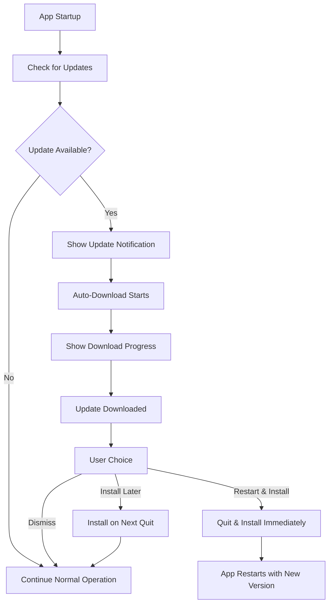

# Flint Auto-Updater Architecture

This document explains the code architecture and update lifecycle of the Flint auto-updater system.

## Overview

The Flint application uses `electron-updater` to provide automatic application updates. The system is designed for private/proprietary applications.

**Current Version:** The application is currently at version 0.1.1 (as specified in `package.json`). Auto-updates will only trigger when a higher version number is available on the update server.

## Architecture

### Components

1. **AutoUpdaterService** (`src/main/auto-updater-service.ts`)
   - Manages all update logic in the main process
   - Handles update checking, downloading, and installation
   - Provides IPC communication with the renderer process

2. **Update UI** (`src/renderer/src/components/UpdateNotification.svelte`)
   - User interface for update notifications
   - Progress tracking for downloads
   - Release notes display

3. **IPC Layer** (`src/preload/index.ts`)
   - Secure communication between main and renderer processes
   - Type-safe API for update operations

4. **Configuration** (`electron-builder.yml`)
   - Build configuration for different platforms
   - Update server URL configuration

### Update Flow



## Features

### Automatic Update Checking

- Can be configured with custom intervals via `startPeriodicUpdateCheck(intervalMinutes)` (default not set - must be enabled manually)
- Manual check via "Check for Updates" button
- Optional startup check with configurable delay (10 seconds by default) via `checkForUpdatesOnStartup()`

### User Control

- Users are notified when updates are available
- Users can view release notes before installation
- Users can choose when to install downloaded updates (immediately or on next quit)
- Downloads happen automatically in the background when updates are available

### Progress Tracking

- Real-time download progress with percentage
- Error handling with user feedback
- Retry functionality for failed operations

### Configuration Options

- Auto-download (default: **true** - downloads happen automatically in background)
- Auto-install on quit (default: **true** - updates install when app quits)
- Allow prerelease updates (configurable)
- Allow downgrade to older versions (configurable)

## File Structure

```
src/
├── main/
│   ├── auto-updater-service.ts     # Core auto-updater logic
│   └── index.ts                    # Main process integration
├── preload/
│   └── index.ts                    # IPC API definitions
└── renderer/src/
    ├── components/
    │   ├── UpdateNotification.svelte # Update UI component
    │   └── Settings.svelte          # Settings integration
    └── env.d.ts                     # Type definitions
```

## Implementation Details

### AutoUpdaterService

The `AutoUpdaterService` class manages the entire update lifecycle:

**Key responsibilities:**
- Initialize electron-updater with configuration
- Handle update check requests
- Manage download progress
- Coordinate installation timing
- Communicate status to renderer via IPC

**Main methods:**
- `checkForUpdates()` - Manually trigger update check
- `checkForUpdatesOnStartup()` - Check for updates on app startup (10s delay)
- `startPeriodicUpdateCheck(intervalMinutes)` - Start periodic checking
- `stopPeriodicUpdateCheck()` - Stop periodic checking

**IPC handlers:**
- `check-for-updates` - Manually trigger update check
- `download-update` - Start update download (rarely needed due to auto-download)
- `install-update` - Install update and restart app via `quitAndInstall()`
- `get-app-version` - Get current version and channel
- `get-update-config` - Get current update configuration
- `set-update-config` - Update configuration (auto-download, auto-install, etc.)

### IPC Communication

The preload script exposes a type-safe API for the renderer:

```typescript
// Exposed to renderer via window.api
{
  // Update operations
  checkForUpdates: () => Promise<{ success: boolean; updateInfo?: UpdateInfo }>
  downloadUpdate: () => Promise<{ success: boolean; error?: string }>
  installUpdate: () => Promise<{ success: boolean; error?: string }>
  getAppVersion: () => Promise<{ version: string; channel: string }>

  // Configuration
  getUpdateConfig: () => Promise<UpdateConfig>
  setUpdateConfig: (config: {
    autoDownload?: boolean;
    autoInstallOnAppQuit?: boolean;
    allowPrerelease?: boolean;
    allowDowngrade?: boolean;
  }) => Promise<{ success: boolean; error?: string }>

  // Event listeners
  onUpdateChecking: (callback: () => void) => void
  onUpdateAvailable: (callback: (info: UpdateInfo) => void) => void
  onUpdateNotAvailable: (callback: (info: { version: string }) => void) => void
  onUpdateDownloadProgress: (callback: (progress: ProgressInfo) => void) => void
  onUpdateDownloaded: (callback: (info: UpdateInfo) => void) => void
  onUpdateError: (callback: (error: { message: string; stack?: string }) => void) => void
  removeAllUpdateListeners: () => void
}
```

### Update Notification UI

The `UpdateNotification.svelte` component provides the user interface:

**Features:**
- Displays update availability with version info
- Shows download progress with percentage and speed
- Presents release notes for user review
- Provides action buttons for user control
- Handles error states gracefully

**User actions:**
- "Show/Hide Details" - Toggle release notes visibility
- "Restart & Install" - Apply downloaded update immediately
- "Install Later" - Defer installation to next quit
- "Dismiss" (close button) - Ignore update notification

## Update Lifecycle

### 1. Startup Check (Optional)

When the app starts:
1. Wait for configurable delay (default: 10 seconds)
2. Check for updates automatically (if enabled)
3. Notify user if update is available

### 2. Manual Check

User can trigger manual check:
1. Click "Check for Updates" in settings/menu
2. Service queries update server
3. Compare current version with available version
4. Show notification if newer version exists

### 3. Download Phase

When update is detected:
1. Download starts automatically in background (if autoDownload is true)
2. Progress events emitted to renderer
3. UI displays download progress (percentage only)
4. On completion, notify user

### 4. Installation Phase

User has two installation options:

**Immediate Installation:**
1. User clicks "Restart & Install"
2. App quits and installer runs
3. New version launches automatically

**Deferred Installation:**
1. User clicks "Install Later" or dismisses notification
2. Update marked for installation on quit (if autoInstallOnAppQuit is true)
3. When user quits app, update installs automatically
4. Next launch runs new version

## Configuration

### Update Server URL

Configured in `electron-builder.yml`:

```yaml
publish:
  provider: generic
  url: https://updates.flintnote.com  # or canary.flintnote.com
```

### Auto-updater Settings

Configured in `AutoUpdaterService` initialization:

```typescript
// Default configuration
autoUpdater.autoDownload = true;  // Automatic background downloads
autoUpdater.autoInstallOnAppQuit = true;  // Install on quit enabled
```

### Check Interval

Optional periodic checking:

```typescript
// Check every 4 hours (example)
setInterval(() => {
  autoUpdater.checkForUpdates();
}, 4 * 60 * 60 * 1000);
```

## Error Handling

The system handles various error scenarios:

**Network Errors:**
- Update check failures due to connectivity
- Download interruptions
- Timeout handling

**Version Errors:**
- Invalid version formats
- Checksum mismatches
- Corrupted downloads

**Installation Errors:**
- Insufficient permissions
- Disk space issues
- Process conflicts

All errors are:
1. Logged to electron-log
2. Communicated to renderer via IPC
3. Displayed to user with retry options

## Security

### Update Verification

`electron-updater` automatically:
- Verifies update signatures (when configured)
- Validates checksums from latest.yml
- Ensures HTTPS for downloads
- Checks code signing on Windows/macOS

### Content Security

1. **HTTPS only** - All update URLs use HTTPS
2. **Checksum verification** - SHA-512 hashes validated
3. **Code signing** - Windows and macOS builds are signed
4. **Notarization** - macOS builds are notarized by Apple

## Platform-Specific Behavior

### macOS

- Uses `.dmg` or `.zip` updates
- Requires code signing for auto-update
- Notarization required for Gatekeeper
- Update installed to `/Applications`

### Windows

- Uses `.exe` installer or NSIS
- Code signing recommended (blocks SmartScreen)
- Update installed to Program Files
- May require admin elevation

### Linux

- Uses `.AppImage` or `.deb`/`.rpm`
- No code signing required
- AppImage updates via file replacement
- Package manager updates via system tools

## Testing

### Development Testing

1. **Mock Update Server:**
   - Set up local server with test updates
   - Configure `dev-app-update.yml` to point to localhost
   - Test update flow without production deployment

2. **Version Testing:**
   - Temporarily lower version in `package.json`
   - Deploy newer version to test server
   - Verify update detection and installation

3. **Error Scenarios:**
   - Simulate network failures
   - Test with invalid update files
   - Verify error handling and recovery

### Pre-Release Testing

Use canary channel for testing:
1. Deploy pre-release version to canary bucket
2. Configure app to use canary updates
3. Test with team before production release

## Monitoring

### Logging

The system logs all update events:

```typescript
autoUpdater.logger = require('electron-log');
autoUpdater.logger.transports.file.level = 'info';
```

**Logged events:**
- Update checks (initiated/completed)
- Downloads (started/progress/completed)
- Installations (started/completed)
- Errors (with full stack traces)

### Analytics

Track key metrics:
- Update check frequency
- Download success rate
- Installation completion rate
- Version adoption timeline
- Error frequency and types

## Best Practices

1. **User Experience:**
   - Never force immediate updates
   - Always show release notes
   - Provide clear action choices
   - Respect user's timing preferences

2. **Reliability:**
   - Handle network interruptions gracefully
   - Implement retry logic
   - Validate downloads thoroughly
   - Log all operations for debugging

3. **Performance:**
   - Check for updates in background
   - Download during idle time (if auto-download enabled)
   - Minimize UI interruptions
   - Optimize update package sizes

4. **Security:**
   - Always use HTTPS
   - Verify signatures and checksums
   - Keep electron-updater up to date
   - Monitor for security advisories

## Troubleshooting

### Update Not Detected

**Possible causes:**
- Version number not higher than current
- Update server not accessible
- Invalid YAML format in latest.yml
- Incorrect publish URL in config

**Debug steps:**
1. Enable debug logging
2. Verify server URL is correct
3. Check latest.yml format
4. Confirm version comparison logic

### Download Fails

**Possible causes:**
- Network connectivity issues
- Server file paths incorrect
- CORS configuration problems
- File corruption

**Debug steps:**
1. Check network logs
2. Verify file URLs in latest.yml
3. Test direct download via browser
4. Examine server response headers

### Installation Issues

**Possible causes:**
- Insufficient permissions
- App already running
- Antivirus interference
- Disk space

**Debug steps:**
1. Check system permissions
2. Verify no other instances running
3. Review antivirus logs
4. Confirm available disk space

## Future Enhancements

Potential improvements:
- Delta updates for faster downloads
- Background downloads with bandwidth limits
- Rollback capability for failed updates
- Multi-language release notes
- Update scheduling (install at specific time)
- Staged rollouts (percentage-based deployment)
